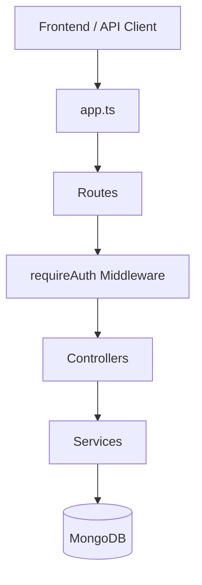

# Buddy Script — Backend

Express and TypeScript REST API for the Buddy Script social platform. It handles authentication, posts, comments, replies, likes, and user profiles backed by MongoDB.

## Project Overview

The API follows a layered architecture: routes validate input, controllers handle HTTP concerns, services contain business logic, and Mongoose models define the data layer. All responses use a consistent success/error envelope.

**Key features**

- JWT access and refresh token authentication
- Post CRUD with public and private visibility
- Cursor-based pagination for post feeds
- Offset pagination for comments
- Nested comments and replies with cascade delete
- Like system for posts, comments, and replies
- Rate limiting and request validation

## Architecture



### API Structure

| Module | Base Path | Responsibility |
|--------|-----------|----------------|
| Users | `/api/users` | Registration, login, profile |
| Posts | `/api/posts` | Post CRUD and feed pagination |
| Comments | `/api/posts/:postId/comments` | Comment management |
| Replies | `/api/comments/:commentId/replies` | Reply management |
| Likes | `/api/likes` | Toggle and list likes |

## Tools Used

| Tool | Purpose |
|------|---------|
| Node.js + Express | HTTP server and routing |
| TypeScript | Static typing |
| MongoDB + Mongoose | Data persistence |
| Zod | Request validation |
| jsonwebtoken | JWT auth |
| bcryptjs | Password hashing |
| helmet + cors | Security headers and CORS |
| express-rate-limit | Rate limiting |

## Setup Instructions

### Prerequisites

- Node.js 18+
- MongoDB instance (local or Atlas)

### Installation

```bash
npm install
cp .env.example .env
```

Configure `.env`:

```env
PORT=8080
NODE_ENV=development
MONGO_URL=mongodb://localhost:27017/buddy-script
JWT_ACCESS_SECRET=your_access_secret_min_32_chars
JWT_ACCESS_EXPIRES_IN=15m
JWT_REFRESH_SECRET=your_refresh_secret_min_32_chars
JWT_REFRESH_EXPIRES_IN=7d
CLIENT_URL=http://localhost:3000
```

### Development

```bash
npm run dev
```

API base URL: `http://localhost:8080/api`

### Production Build

```bash
npm run build
npm start
```

## Deployment Steps

1. Provision a Node.js runtime and MongoDB database (e.g. MongoDB Atlas).
2. Set all environment variables from `.env.example` in the hosting platform.
3. Set `NODE_ENV=production` and update `CLIENT_URL` to the deployed frontend URL.
4. Run `npm run build` and start with `npm start`.
5. Expose the service on HTTPS and point the frontend `NEXT_PUBLIC_API_BASE_URL` to `/api`.

## Problems Faced

**Pagination**

- Offset-based pagination caused duplicate and skipped posts when new items were inserted while users scrolled. Post feeds were moved to cursor-based (keyset) pagination using `createdAt` and `_id` as a composite cursor.
- Posts sharing the same `createdAt` timestamp broke simple date-only cursors. A tiebreaker on `_id` in the MongoDB filter resolved ordering edge cases.
- Invalid or tampered cursors needed safe decoding. Cursor values are base64url-encoded and validated before being applied to queries.

## What You Learned

- Implementing keyset pagination with encoded cursors for stable infinite scroll feeds.
- Separating cursor pagination (posts) from offset pagination (comments) based on access patterns.
- Handling cascade deletes across posts, comments, replies, and likes inside MongoDB transactions.
- Enforcing ownership checks and consistent API error responses across resources.
